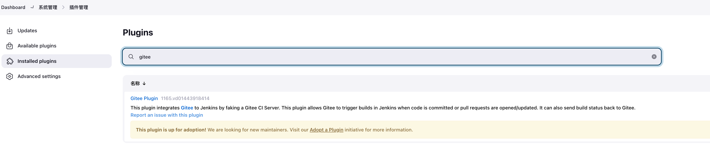
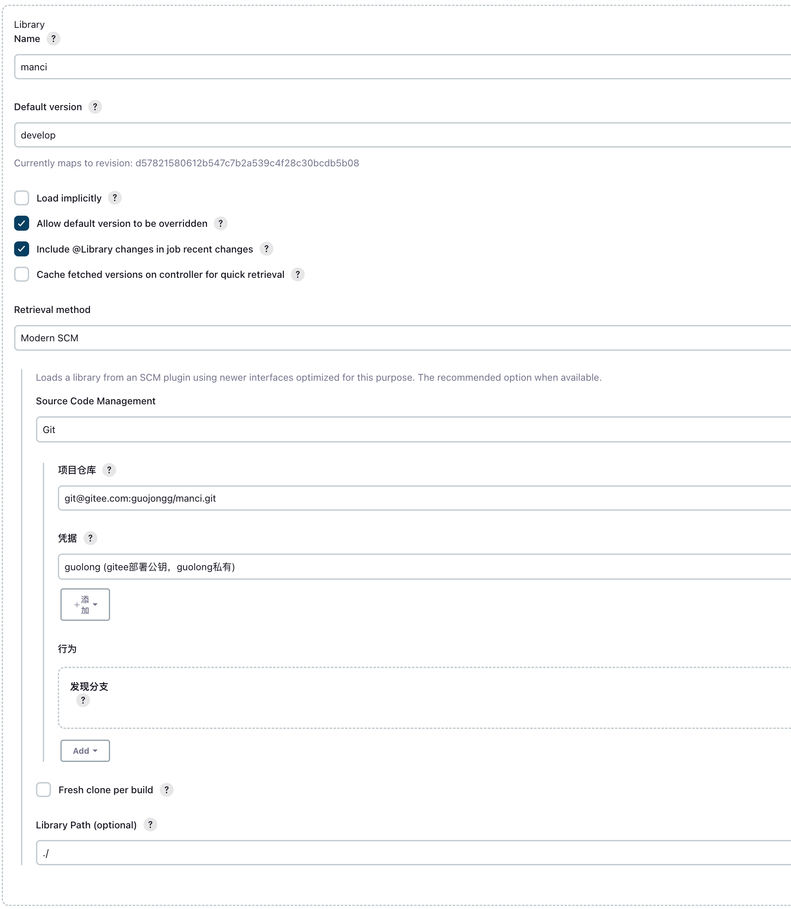
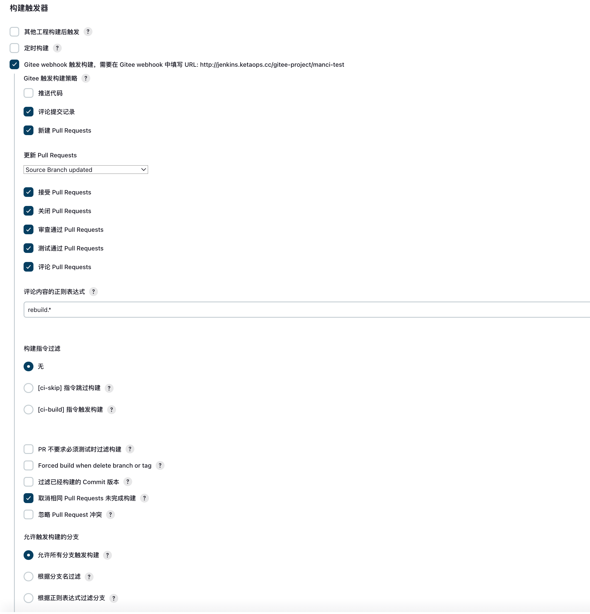
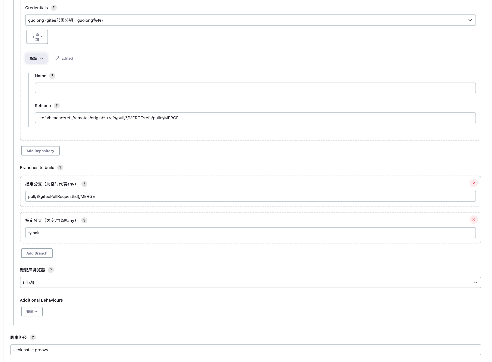
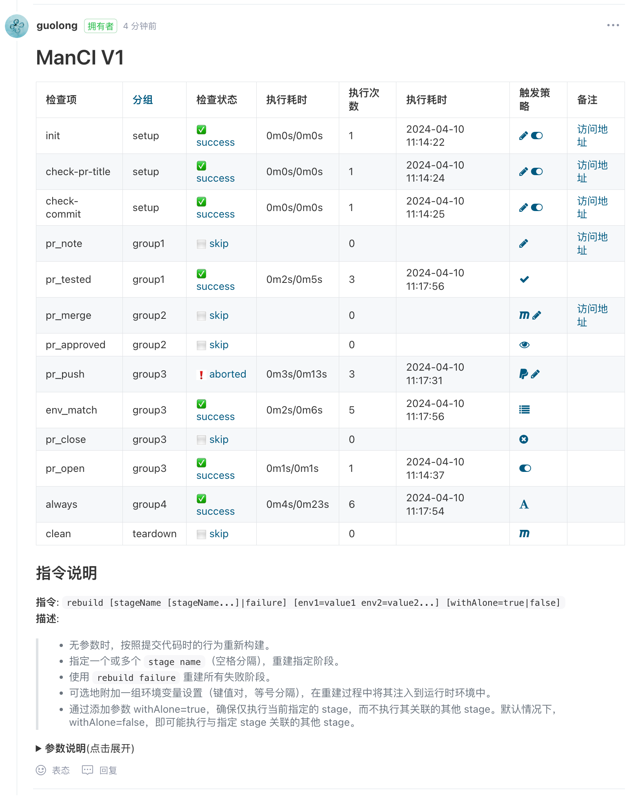

# ManCI：面向中国开发者生态的 Jenkins 流水线简化自动化框架

## 介绍

ManCI 是一款专为中国开发者社区打造的 Jenkins 流水线自动化框架，旨在应对当前 CI 过程中的挑战，借鉴 GitHub 的 CI 工作流最佳实践，并通过 Jenkins 库的形式，无缝对接国内广泛使用的代码托管平台——Gitee，为国内开发团队提供一套便捷、高效、本土化的 CI 解决方案。

### 国内 CI 现状与痛点

当前，国内的 CI 流程尚处于发展阶段，普遍存在以下问题：

1. **工具局限性**：尽管 Jenkins 被广泛应用，但它往往仅被当作一个基础构建工具，缺乏针对 CI 流程的深度整合与智能化管理。

2. **人工干预多**：很多团队的 CI 过程仍严重依赖人工触发与监控，自动化程度低，导致效率低下，易出错。

3. **平台对接不畅**：对于国内常用的 Gitee 等代码托管平台，现有的 CI 工具往往缺乏深度集成，无法实现 PR 页面的实时反馈与交互。虽然当前 Gitee 平台自身集成了 Gitee Go，但总觉得缺点意思，主要是不够灵活。

### ManCI 的价值与优势

针对上述痛点，ManCI 以 Jenkins library 形式出现，旨在提供：

#### **自动化驱动的 CI 流程**

- **智能触发**：ManCI 自动响应 Pull Request（PR）生命周期中的关键事件（如打开、更新、合并、关闭、评论、测试通过、审核通过等），无需人工干预即可启动相应的代码检查、构建、测试等任务。

- **动态执行**：根据 PR 状态、代码改动范围、环境变量等因素，动态确定应执行的 CI 阶段，避免无效或过度的构建工作。

#### **Gitee PR 页面深度集成**

- **实时反馈**：ManCI 能在 Gitee PR 页面上直接展示 CI 表格，清晰罗列各阶段的执行状态、耗时、触发原因等信息，让团队成员无需离开 PR 界面即可掌握完整构建进度。

- **交互式操作**：支持通过 PR 评论触发特定阶段重跑、传递自定义参数等操作，使开发者能在 PR 页面直接与 CI 流程互动，提升协作效率。

- **自动管理标签与评论**：根据 CI 结果自动为 PR 添加标签（如“ci-success”、“ci-failure”等），并在 PR 下通过直观的表格反馈构建结果，确保团队成员及时获取反馈，促进代码审查与合并决策。另外可以结合 Gitee 的最低测试人功能来设置质量门禁，当 CI 执行成功时，会给 PR 测试通过，否则不允许合并代码。

## 快速入门

### 安装与配置
1. **安装Jenkins Gitee插件**：在 Jenkins 插件管理中搜索 Gitee Plugin 进行安装。

2. **安装 ManCI**：在 Jenkins 系统管理，Global Pipeline Libraries中添加 ManCI 库，并配置相关参数。

3. **配置 Gitee API**：在 Jenkins 配置中，添加密钥 Gitee API 的私有令牌，确保 ManCI 可以访问 Gitee 服务。
    1. 访问 Gitee API，申请一个私有令牌
    2. 在 Jenkins 密钥管理中，添加一个 secret text 类型的密钥，输入 Gitee API 的私有令牌。密钥ID记录下来
4. **配置 Gitee 仓库密钥**：在 Jenkins 配置中，添加 git ssh 密钥，确保 ManCI 拉取代码。
    1. 生成一对 ssh 公私钥对
    2. 在你的 Gitee 个人设置 -> SSH 公钥中添加公钥
    3. 在 Jenkins 中设置其密钥的私钥，记录下密钥 ID
5. **新建 Job**: 新建一个流水线项目，配置参考

6. 在 gitee 仓库的 webhook 配置中添加 Jenkins 中给出的 webhook 地址
### 使用示例
在你的项目中添加Jenkinsfile，示例参考项目目录下的 [Jenkinsfile.groovy](./Jenkinsfile.groovy)

### 展示效果
